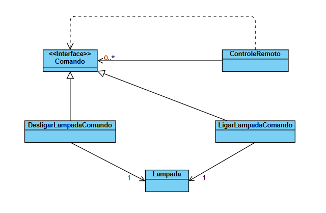

# Padrão Command - Exemplo de Automação Residencial (Lâmpada)

Este projeto apresenta um exemplo prático da implementação do padrão de projeto comportamental **Command** em Java. O cenário simula um sistema de automação residencial onde um controle remoto gerencia o acionamento de uma lâmpada inteligente, permitindo inclusive desfazer ações.

## Sobre o Padrão Command

O padrão **Command** encapsula uma solicitação como um objeto, permitindo que você parametrize clientes com diferentes solicitações, enfileire ou registre solicitações e suporte operações que podem ser desfeitas.

Neste exemplo:
- O **Controle Remoto** (Invoker) não sabe como a lâmpada funciona, ele apenas dispara comandos.
- A **Lâmpada** (Receiver) é quem realmente sabe como ligar ou desligar.
- Os **Comandos** (Ligar/Desligar) fazem a ponte entre o Controle e a Lâmpada.

## Estrutura do Projeto

Abaixo, o mapeamento das classes do projeto para os papéis do padrão Command:

| Classe | Papel no Padrão | Descrição |
| :--- | :--- | :--- |
| **`Comando`** | *Command (Interface)* | Interface que define os métodos `executar()` e `cancelar()`. |
| **`Lampada`** | *Receiver* | O objeto que realiza a ação real (contém a lógica de negócio). |
| **`ControleRemoto`** | *Invoker* | Solicita que o comando seja executado e mantém o histórico para desfazer ações. |
| **`LigarLampadaComando`** | *Concrete Command* | Implementa a ação de ligar a lâmpada. |
| **`DesligarLampadaComando`** | *Concrete Command* | Implementa a ação de desligar a lâmpada. |

## Diagrma de Classes

